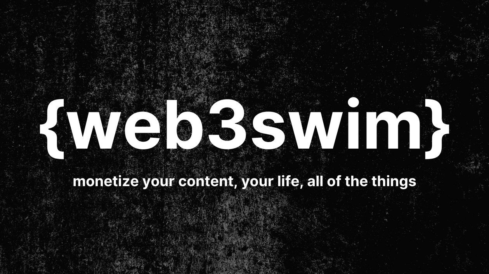

# Web3Swim

### Tools Utilized:
* **Front-End:** NEXTjs with TypeScript
* **Back-End:** Solidity (Smart Contracts) + Moralis (Database) + Thirdweb (Middleware)
* **Blockchain:** Polygon (ERC20 Coin Contract + ERC721 NFT Contract)
* **Video Streaming:** Livepeer (Decentralized Streaming)
* **Storage:** IPFS & Filebase (NFTs)

## Watch Our Video

[View the video on Vimeo](https://vimeo.com/685326701/807ea6509e)

## OpenSea Collection
### 
[View on OpenSea (Polygon x IPFS x Filebase)](https://testnets.opensea.io/collection/web3swim-nft)

## Getting Started

First, run the development server:

```bash
npm run dev
# or
yarn dev
```

Open [http://localhost:3000](http://localhost:3000) with your browser to see the result.

You can start editing the page by modifying `pages/index.tsx`. The page auto-updates as you edit the file.

[API routes](https://nextjs.org/docs/api-routes/introduction) can be accessed on [http://localhost:3000/api/hello](http://localhost:3000/api/hello). This endpoint can be edited in `pages/api/hello.ts`.

The `pages/api` directory is mapped to `/api/*`. Files in this directory are treated as [API routes](https://nextjs.org/docs/api-routes/introduction) instead of React pages.

## Learn More

To learn more about Next.js, take a look at the following resources:

- [Next.js Documentation](https://nextjs.org/docs) - learn about Next.js features and API.
- [Learn Next.js](https://nextjs.org/learn) - an interactive Next.js tutorial.

You can check out [the Next.js GitHub repository](https://github.com/vercel/next.js/) - your feedback and contributions are welcome!

## Deploy on Vercel

The easiest way to deploy your Next.js app is to use the [Vercel Platform](https://vercel.com/new?utm_medium=default-template&filter=next.js&utm_source=create-next-app&utm_campaign=create-next-app-readme) from the creators of Next.js.

Check out our [Next.js deployment documentation](https://nextjs.org/docs/deployment) for more details.
